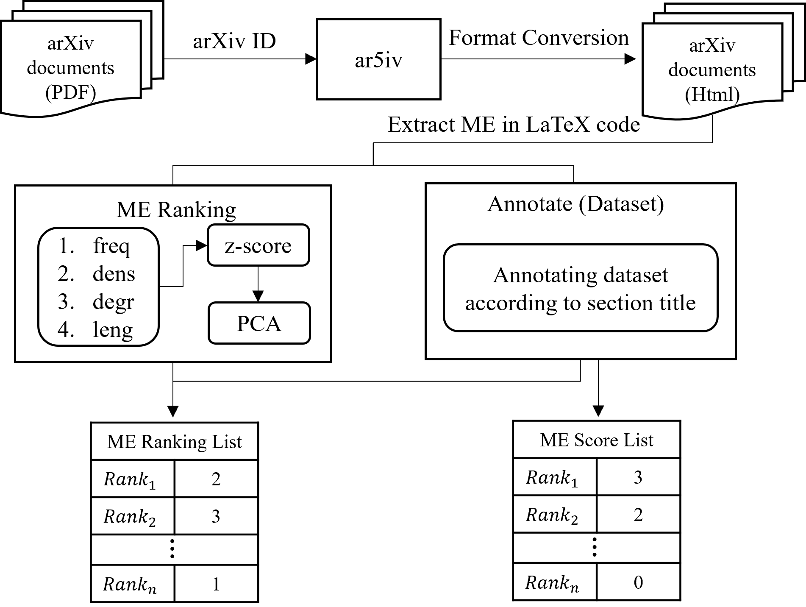

# MERank
This is an initial code repository for the ranking algorithm of mathematical equations within a scientific document.

## Overview



## How to Run

Here is the basic flow to run these scripts:

1. Run `goldstandard.py` and `meRank.py` to generate the ranking lists (json files).
2. Use `calculateResult.py` to get the NDCG and Kendall's Tau measurements.

## Dependencies

This project requires Python 3.7 and the following Python packages:

- `beautifulsoup4`
- `lxml` (optional)
- `tqdm`
- `numpy`
- `sklearn`

You can install these packages using pip:

```bash
pip install beautifulsoup4 lxml tqdm numpy scikit-learn
```
Feel free to explore and contribute to this project.